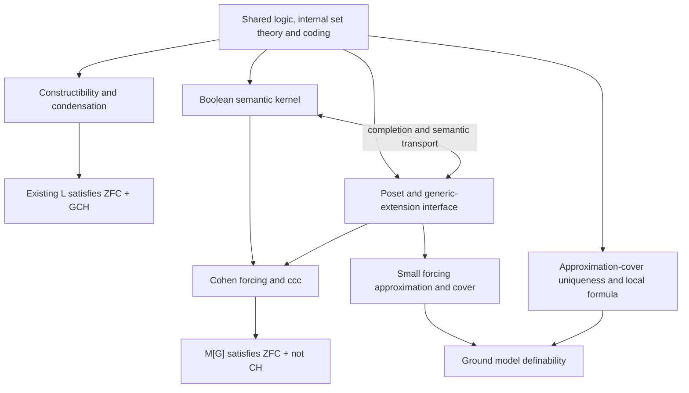

# Cohen extensions, Flypitch4, and Bedrock's shared infrastructure

Research date: 2026-09-08. This is an application and evidence note for adding a Cohen extension that violates GCH to the existing L development and planned ground-definability project. The authoritative architecture and schedule are in [the forcing and geology system design](forcing-geology-design-2026-09.md); prescriptive language here describes Cohen obligations within that plan rather than a competing roadmap. Only research notes are changed. No source implementation, external project build, or new theorem is claimed.

The first headline is now Cohen, followed by ground definability. The [detailed implementation roadmap](cohen-implementation-roadmap-2026-09.md) specifies K0-K11, including certified automatic completion, semantic transport and separate chain-condition certificates. The master plan retains authority over long-term architecture.

## 1. Decision

The shared architecture must provide two complete usable public interfaces, one based on posets and one based on complete Boolean algebras, together with systematic equivalence bridges. Cohen forcing is an initial substantial application after the common contracts and an initial bridge slice have tested both faces. A shared mathematical fact should have one canonical proof, initially in the Boolean semantic kernel when that is its natural home, and reach the other public interface by proved transport. Independently duplicated forcing theorems, truth lemmas, substitution proofs or ZFC-transfer arguments would make the two interfaces drift.

This is not a measured claim that a new Agda implementation will be faster than a port. It is a cohesion requirement for the longer program, whose interfaces must already anticipate iterations, symmetry, quotients and the distinct class-forcing boundary even though their full theorems are later scoped work. Reuse the existing L result for the positive GCH branch; do not reproduce Flypitch4's collapse branch merely to obtain a theorem already supplied by L.

The earlier survey missed the 2026 Lean 4 port. It is real and must be distinguished from the original Lean 3 repository. The dedicated [Flypitch4 source audit](flypitch4-source-audit-2026-09.md) pins the source and separates inspected evidence from reported validation. The [infrastructure audit](cohen-infrastructure-overlap-2026-09.md) records current Bedrock definitions and the missing Cohen lemmas. The [system design](forcing-geology-design-2026-09.md) is the sole authoritative roadmap. Shared contracts and an initial working equivalence bridge precede the concrete Cohen and geology milestones. Complete developments of long iterations, symmetric forcing and class forcing do not precede those applications, but their needs constrain the public contracts from the outset.

## 2. The theorem to target

The user's stated result is an extension theorem. A useful precise first target is:

    Given a transitive ZFC ground M, κ = (ω₂)^M,
    P = Fn(κ × ω, 2, finite)^M, and an M-generic G ⊆ P,
    the extension M[G] satisfies ZFC and ¬CH, hence ¬GCH.

All cardinal symbols and finite-function collections are computed in M. Conditions are ordered by reverse inclusion. Existence of the supplied generic is a separate theorem or hypothesis, not part of what the displayed implication proves. For countable transitive set models, a generic-existence construction can supply G. It does not prove that a countable transitive ZFC model exists from ZFC alone.

There are three related but different endpoints:

| Endpoint | What must additionally be supplied |
|---|---|
| The displayed extension theorem | Names, genericity, forcing theorem, ZFC transfer, Cohen combinatorics and cardinal preservation |
| Existence of such a concrete extension in the ambient setting | A suitable starting model and generic-existence argument in that setting |
| Syntactic nonprovability or independence over first-order ZFC | Object-language ZFC/CH/GCH, satisfaction bridges, proof system and soundness, plus a suitable semantic countermodel construction or a formal relative-consistency argument |

A Boolean-valued countermodel plus Boolean soundness can establish nonprovability without producing an external generic. First-order completeness can turn consistency information into some ordinary model, but does not supply a prescribed transitive ground and its generic extension. These distinctions explain why a syntactic Flypitch endpoint is not automatically the endpoint requested here.

For this task, proving ¬CH is sufficient: GCH includes its instance at ω. No requirement to calculate the continuum exactly as ω₂, and no requirement that the starting model already satisfy GCH, belongs in the minimal Cohen proof. Exact continuum values and control of GCH at other cardinals are separate, more expensive applications.

## 3. What Flypitch4 contributes

The actual port is in Ian Klatzco's fork, subtree `flypitch4`, at commit `ad649f89e9f3107b7e2ea97a58b2eafdfc80b815` (2026-07-10). Its toolchain file pins Lean `v4.30.0-rc2`. The summary exports Boolean-valued ZFC, CH nonprovability in both directions, and `independence_of_CH`; it also exports a completeness theorem. The main result is a statement about a deep-embedded proof relation. [Pinned summary](https://github.com/ianklatzco/flypitch/blob/ad649f89e9f3107b7e2ea97a58b2eafdfc80b815/flypitch4/Flypitch4/Summary.lean).

The positive CH branch uses collapse forcing. The Cohen branch establishes its negative result in a Boolean-valued universe. The author's blog mentions the historical Gödel/L construction, but this is not evidence that the port implements constructibility. The source audit, rather than that historical explanation, determines the actual dependency map.

Our inspection does not rebuild the project. Checked-in reports describe build, axiom and statement-comparison validation. Those reports are useful evidence, but they must remain labelled as the port's reported checks, not newly reproduced verification by Bedrock. The detailed audit records proof-hole and axiom findings at their actual scope.

## 4. Overlap by mathematical layer

This table describes architectural overlap, not percentages of proof lines or predicted engineer time. No calibrated estimate supports a numerical percentage.

| Infrastructure | Existing L/GCH work | Cohen extension | Ground definability | Reuse decision |
|---|---|---|---|---|
| Formula syntax, environments, renaming and semantic evaluation | Substantial existing code | Essential | Essential | Share directly where interfaces are already generic |
| First-order axiom theory, internal foundation/infinity, schema bridges | Current strong model record needs a first-order companion | Needed for general model statements and independence | Needed for internal candidate/ground statements | Build once; adapt existing concrete models |
| Internal functions, injections, ordinals and cardinals | Existing, often specialized to L | Needed for ω₁, ω₂ and preservation | Needed for regular δ, sizes and successor agreement | Generalize the actual mathematical interfaces with real consumers |
| Rank, set coding, recursion and satisfaction for set structures | Existing constructions and L-specific realizations | Used in names, forcing definability and axiom transfer | Used heavily in rank-local candidates and theory recognition | Share the generic foundations; existing L theorems need adapters |
| Constructible stages, Skolem hulls and condensation | Central to L⊨GCH | Not required for arbitrary-ground Cohen forcing | Not required as constructibility-specific theorems | Preserve as the positive L branch |
| Names, valuation, generic filters, forcing definability and ZFC transfer | Absent | Core dependency | Core dependency of set-forcing application | One common forcing development |
| Finite partial functions, compatible unions, ccc, many distinct reals | Absent as Cohen machinery | Main application-specific increment | An example, not an abstract geology prerequisite | Separate Cohen application over the common forcing API |
| Approximation, cover, uniqueness, eligible ranks and ground formula | Absent | Not required for ¬CH | Main application-specific increment | Separate geology branch over shared set theory/forcing |
| Boolean completions, weighted values and Boolean soundness | Evaluation signature exists; mathematics absent | Required public semantic interface and preferred initial proof home | Required bridge partner for the common forcing kernel | Build with the poset interface and transport shared theorems systematically |

The biggest future overlap is between Cohen and the forcing part of geology. The biggest existing overlap is the logic, coded set mathematics and internal/external bridge discipline developed for L. The intricate condensation argument proving GCH in L is largely a separate branch. It supplies a completed positive result, not most of the Cohen proof.

## 5. The Cohen increment after the common core

The following is our proposed implementation decomposition. It does not claim these lemmas already exist in Bedrock.

1. Construct the set of finite functions from κ × ω to 2 in M. Give the empty condition, restriction, compatible union and one-coordinate extension. Prove that the internal and external readings used by the transitive model interface agree.
2. Prove ccc in M. A direct finite-support route uses a delta-system argument on uncountably many domains, thins to common values on the finite root, and finds compatible conditions. Keep the finite combinatorics independent of forcing semantics.
3. Prove the required chain-condition preservation theorem once for arbitrary posets. A name for a function has a controlled set of possible values at each coordinate, obtained using antichains. Apply the theorem to preserve M's ω₁ and ω₂ in the extension.
4. Take the generic union and prove every coordinate α < κ produces a total function ω → 2. For each coordinate/argument (α,n), the conditions whose domain contains (α,n) form a dense set in M. This says a value is assigned, not that either predetermined bit value can be forced below every condition.
5. For α ≠ β, prove density of conditions making the two coordinate reals disagree at some fresh natural number. Genericity then gives pairwise distinct reals.
6. Build the indexed family as an actual function in M[G], not merely an external collection of reals. Its injection κ → P(ω), together with preserved ω₁ < ω₂, proves ¬CH. Derive ¬GCH through the ω-instance of the common GCH formulation.

Step 3 is essential: producing many generics indexed by a ground ordinal does not prove ¬CH if that ordinal might have collapsed. Step 6 is also essential in this repository: an Agda function between carriers is not automatically an internal set-coded injection.

For the minimal target, omit nice-name counting, an upper bound on the continuum, continuum-function calculations above ω, Easton forcing, and collapse forcing for the positive CH branch. These can become later examples without changing the core.

Flypitch4 makes analogous Boolean assertions about distinct coordinate reals and cardinal comparisons, using the regular-open Cohen algebra and topology-based ccc infrastructure. Its `aleph2_le_powerset_omega` and `neg_CH` endpoints are useful local specifications for our application, even when our names and truth theorem use a different representation. [Pinned Cohen source](https://github.com/ianklatzco/flypitch/blob/ad649f89e9f3107b7e2ea97a58b2eafdfc80b815/flypitch4/Flypitch4/Forcing.lean).

## 6. Joining Cohen with L and geology

The overall dependency structure has two public forcing interfaces over shared foundations and three main consumers. The transport edge denotes proved semantic agreement, not parallel implementations of the same mechanical proof:

There is a compelling eventual combined example: start from a suitable constructible ground, form a Cohen extension, retain the ground's positive GCH theorem, prove the extension fails CH, and recover the ground by the uniform defining formula. Under the proper ambient/model hypotheses, this realizes all three themes in one example.

Three bridges must not be skipped in that example. First, the poset and Boolean presentations must agree through the systematic completion, name, value and forcing transports required by the public architecture. Second, the present universe-sized L is not automatically an externally countable transitive model with an available generic; instantiate the example in a setting where the generic-existence assumptions are actually supplied. Third, a claim about the extension's own constructible class L requires absoluteness/comparison of the L construction, not merely reuse of a theorem whose carrier is the old ground.

Ground relativity is independent of the representation split between host constructions and internal syntax. A host-level construction can realize names, Boolean completions, valuations or extensions efficiently, but each advertised ground-relative theorem still needs a correctness adapter to the ground's coded objects and object-language predicates. Conversely, an internal formula does not by itself identify which ground or ambient structure supplies its quantifiers. Maximize reuse of Agda host constructions where they simplify recursion and algebra, then prove the internal coding and satisfaction bridges needed by the public statement.

Cohen's ccc and geology's approximation parameter are different contracts. The generic small-forcing route can use δ = (|P|⁺)^M. For the chosen P of ground size ω₂, this gives δ = ω₃ of M. Ccc supplies cardinal preservation but does not by itself imply the ω₁-approximation property. A smaller parameter may follow from an additional theorem about the particular forcing; it must not be inferred just from ccc.

For a future syntactic independence theorem, add a constant-free `GCH` formula and a correctness bridge to the existing `GCHStatement`. The positive side can then use L with soundness; the negative side uses the Cohen countermodel and the implication GCH → CH. Merely placing the two semantic theorem names together is not yet an object-language independence proof. The hypotheses of the countermodel construction and the host metatheory must remain explicit.

## 7. What to take from Flypitch4

| Flypitch4 component | Recommended treatment in Bedrock |
|---|---|
| Boolean equality congruence, substitution and semantic soundness decomposition | Reuse mathematical statements and organization when adding Boolean semantics |
| Cohen coordinate names and distinctness/cardinal lemmas | Use as cross-checks and possible proof templates for the corresponding ground-relative lemmas |
| PSet/ordinal/cardinal representation and host choice | Compare with existing V/ordinal/internal-cardinal interfaces; do not replace them wholesale |
| Entire universe-indexed bSet construction | Use as evidence for proof decomposition; Bedrock may instead maximize existing host constructions with proved ground-coding adapters |
| Complete Boolean algebra operations over host-indexed families | Keep distinct from completeness for families belonging to a ground model; neither form silently supplies the other |
| Collapse forcing for CH | Omit from the initial roadmap; L already gives the positive GCH result |
| Deep first-order proof system and soundness | Required if syntactic independence becomes an endpoint; adapt to existing Bedrock syntax |
| First-order completeness | Useful for some model-existence endpoints, but unnecessary for the direct soundness-based nonprovability inference |
| Lean tactics and mathlib interfaces | Treat as Lean-specific implementation, not directly portable Cubical Agda infrastructure |

The practical choice is selective mathematical reuse inside the two-interface architecture. The forcing theorem and extension ZFC should have one canonical proof and be exposed at both interfaces through transport; Cohen and geology then consume the public face appropriate to each argument. Generic set-theoretic coding remains shared with L, while the specialized L proof stays intact. Copying the entire Flypitch arrangement would add its positive-CH machinery while still leaving the actual ground-extension and definability adapters to build.

There is also a viable **ground-relative Boolean core**: construct weighted set-coded names and Boolean values inside M, then specialize at an M-generic ultrafilter. Boolean forcing is fully capable of supporting actual extensions and geology. The limitation just identified belongs to Flypitch's chosen implementation and exported endpoints, not to the mathematical Boolean method.

| Whole-system option | Main advantage | Additional work for our combined goal |
|---|---|---|
| Closely reproduce Flypitch's host Boolean universe | Follow a completed independence proof with explicit source lemmas | Adapt a new large-name universe to Cubical foundations; add ground-relative names, generic specialization and geology |
| Ground-relative Boolean core | Algebraic semantics with actual ground/extension data from the start | Internal completion and admissible joins, weighted name codes, generic truth and internal definability |
| Ground-relative poset core with optional later Boolean client | Shorter route to one extension theorem | Rejected for the project architecture: it postpones the second required public interface and its equivalence obligations |

The system design chooses neither of the last two rows as a single exclusive backend. It requires the ground-relative Boolean kernel and the ground-relative poset interface as complete public faces, with an early bridge slice and systematic transport thereafter. The Boolean kernel is the preferred initial proof home for semantic laws, while concrete generic extensions and geology keep a direct poset-facing API. This preference does not license duplicating all proofs in both representations or treating Boolean semantics as the only definitive account.

Boolean completion also does not preserve every application property by mere interchange of notation. `RO(P)` has the same forcing semantics through the proved dense embedding, but its carrier size, external versus ground-internal completeness, closure presentation and combinatorial witnesses need separate theorems. In particular, a finite-condition closure or size argument about `P` cannot be reused as the identical statement about `RO(P)`. Transport only what the bridge actually proves.

## 8. Evidence and validation

The source audit and overlap note provide the primary source ledger and current Bedrock pointers. The port was inspected at a pinned commit and was not rebuilt locally. No source or glossary change is part of this investigation. Validation after integration:

- Scoped prose lint over the three new notes and two corrected earlier notes: exit 0.
- Scoped glossary check using the project `.venv/bin/python`: exit 0.
- Local link, balanced-fence and forbidden-em-dash checks: exit 0, five documents and eleven local links.

The source chapter-framework checker is not applicable to English developer research notes. An attempted invocation on the overlap note returned exit 1 because it requires trilingual chapter markers; no source chapter or research note was changed to satisfy that unrelated requirement. No Agda or Lean build was run. The only repository changes in this follow-up are the three new literature notes and the two explicitly linked corrections to earlier literature notes.
