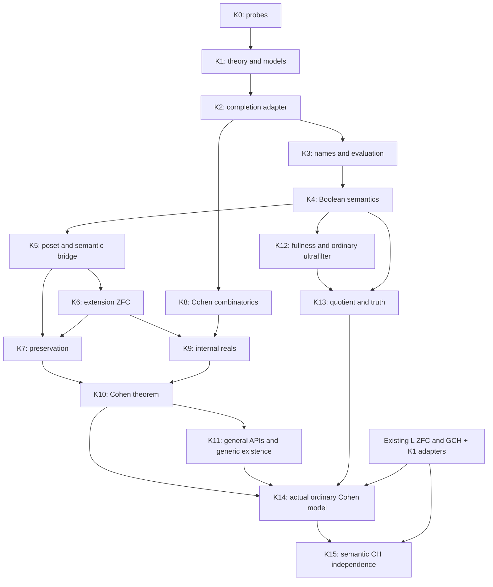

# Trophy 3: construct an ordinary model of ZFC + not CH

Design date: 2026-09-08. Status: implementation roadmap with checked temporary K0 probes; no production forcing modules have been added. This refines the [long-term architecture](forcing-geology-design-2026-09.md), which remains authoritative for component boundaries. The global sequence is T1: L satisfies ZFC (proved), T2: L satisfies GCH (proved), T3: construct an ordinary model of ZFC + not CH, T4: ground-model definability. T3 follows the general forcing results and adds an actual model constructor; it does not replace those results. This ordering does not weaken either public interface, the required semantic bridges, or the future extension calculus. The owner requested this planning deliverable in `dev/literature`; source implementation and teaching integration require subsequent scoped briefs.

The [Bell 2005 reassessment](bell-2005-route-reassessment-2026-09.md) supplies textbook theorem locators and refines the contracts below. The [full text](bell-2005-boolean-valued-models.fulltext.md) is a search artifact; exact mathematical expressions can be checked in the [local PDF](bell-2005-boolean-valued-models.pdf).

## 1. The result and its completion contract

The final T3 constructor targets the existing host foundations plus `LEM (ℓ-suc ℓ)` and returns an inhabited ordinary first-order structure N, with equality and membership interpretation, and proofs of every ZFC axiom/schema and not CH. Neither a ground model, a generic G, nor an ultrafilter U may remain an unconstructed input of this final instance. This exact assumption budget is a target to validate, not a checked theorem: universe levels, internal witness extraction and quotient formation remain K0/K12-K15 obligations. An extra host-choice assumption requires an explicit scope decision, not a silent addition.

Schematic public outputs, not existing Agda declarations:

```text
CohenModel(lem) = N
CohenModel-ZFC(lem) : N ⊨ ZFC
CohenModel-not-CH(lem) : N ⊨ ¬CH

SemanticCHIndependence(lem) =
  (positive model, proof of ZFC + CH,
   negative model, proof of ZFC + ¬CH)
```

The positive model is the adapted existing L; the negative model is the constructed quotient. Exact carriers and universe annotations must be fixed by checked contracts. No `Con(ZFC)`, externally countable ground, G or U is an additional argument of these final instances.

The selected instance uses existing L, internally constructs the Cohen completion B and its Boolean name model, proves the required sentences have value top, constructs an ordinary ultrafilter U, and forms the two-valued quotient N. It does not assert that N is externally well-founded, a transitive extension of the current L, or satisfies the existing strong `isZFCModel` record unchanged. Ordinary first-order Foundation and external accessibility must remain distinct.

The following universal supplied-generic theorem remains a mandatory prerequisite of T3 acceptance, together with both public interfaces and their bridge. Completing only the quotient instance is insufficient.

Given a transitive ground M satisfying first-order ZFC, let κ = (ω₂)^M and P = Fn(κ × ω, 2, finite)^M, ordered by reverse inclusion. For a supplied M-generic filter G, construct the actual extension and prove:

    M[G] satisfies ZFC + not CH, hence ZFC + not GCH.

All sets, finite-function collections and ground cardinals in the hypothesis are computed in M. The semantic CH predicate and its object-language sentence must agree; likewise for the ω-instance of GCH. The conclusion must identify the extension's ω₁ with the embedded ground ω₁, not merely preserve an ordinal comparison. The function witnessing many reals must be an internal set-coded injection in M[G].

Deliver three connected outputs: the poset theorem, the corresponding Boolean-name/value theorem for the internally computed completion, and the theorem identifying their generic specializations. Include a separate generic-existence corollary for an externally countable transitive set ground, with an explicit enumeration or the exact hypotheses producing one. Do not assert that such a ground exists. The generic-existence constructor is a library facility, not a restriction on the supplied-generic theorem.

For proper-class ground instances, the ambient realization must explicitly support the ground predicate, recursion, names and extension interpretation being used. Do not manufacture an L-generic in the existing ambient universe from L⊨ZFC. An L specialization is conditional on the requisite realization and generic, and cannot be used to discharge the main theorem vacuously.

The milestone requires neither exact continuum ω₂, nice-name counting nor ground GCH. The committed semantic program excludes formal deduction systems, syntactic independence and PRA relative-consistency proofs. These are not mandatory follow-up work for this trophy. Formulas, semantic correctness and internal definability remain required. Preserve the existing L⊨ZFC and L⊨GCH unchanged.

## 2. Implementation sequence and dependency graph

K labels are implementation work packages, not final Agda module names. F labels refer to the master architecture. A package can be split into coherent source briefs; its exit condition remains mandatory.

| Package | Architecture phase | Requires | Concrete output |
|---|---|---|---|
| K0: representation probes | F0 | Existing audits | Safe witnesses for model, names, sizes and the compiler boundary |
| K1: theory and model adapters | F1 | Accepted K0 contracts | Common ZFC/CH/GCH interpretation and transitive-ground interfaces |
| K2: structural forcing and automatic completion | F1/F2 | Relevant K1 set/model primitives | Preorders, lawful Booleans, model-internal completion and B⁺ certificates |
| K3: names and structural evaluation | F2 | K1, relevant K2 | Names, codes, valuation, translations, check and generic names |
| K4: Boolean semantics and internal compiler | F3 | K1-K3 | Sized formula values, equality laws, definability and separate witness capabilities |
| K5: poset clauses and semantic bridge | F4 | K2-K4 | Recursive clauses, formula agreement, generic truth and extension correspondence |
| K6: extension theory | F5 | K3-K5 | ZF, separate AC and ordinal transfer, trivial forcing and both public APIs |
| K7: chain conditions and preservation | Early F5 preservation slice | K1-K5; K6 for extension cardinal interpretation | Distinct CCC predicates and ground-ZFC cardinal preservation |
| K8: Cohen conditions and ccc | C1 | K1 and K2 structural posets | Internal finite maps, coordinate density, delta-system ccc |
| K9: internal family of reals | C2 | K3-K6, K8 | Set-coded family, Boolean correspondence and distinctness |
| K10: general Cohen forcing theorem | C3 | K6-K9 | Both theorem presentations and their generic specialization |
| K11: generic-existence constructor and general API integration | F5/C3 integration | K2; K10 for final application | Countable-ground corollary and validated general interfaces |
| K12: fullness and ordinary-ultrafilter existence | F3/F5 model realization | K1-K4, ground ZFC | Reusable witness theorem; internally constructed ultrafilter with host interpretation |
| K13: ordinary quotient and truth | F5 model realization | K4, K12 | General two-valued quotient, well-defined relations and formula truth theorem |
| K14: actual Cohen model | F6/C4 | K10-K13 and L adapters | Construct N and prove ordinary ZFC + not CH without a supplied G or U |
| K15: semantic CH independence and release | F6/C5 | K14, existing L theorems, K1 | Shared positive/negative model package, assumption audit and integration gates |

K8 starts as soon as its set mathematics is ready; it need not wait for semantics. The generic-enumeration part of K11 can also start early. K7's possible-value arguments and K6's axiom proofs can progress separately after K5. K10 cannot bypass K6 or K5 because a host Boolean countermodel is already available.



The general forcing critical path includes K0-K6 followed by preservation and the Cohen family. T3 additionally requires K12-K14; their witness, quotient and assumption obligations are substantive, not a final wrapper. This is a dependency estimate, not a timing prediction. Ground-definability uniqueness and rank-local coding can develop independently after their own foundations exist; they are not prerequisites of Cohen.

## 3. K0: resolve representation risks with real probes

Produce a short representation decision record accompanied by small `--safe` Agda probes in a task-specific temporary directory. Use actual existing interfaces where possible, not renamed empty records.

| Probe | Required evidence | Failure response |
|---|---|---|
| Ground/profile adapter | A concrete structure with equality coherence and an interpreted axiom; inspect Foundation and Infinity separation | Split strong host model assumptions from first-order axioms |
| Raw-name carrier | A well-founded recursive name operation and its universe/h-level obligations | Choose a justified material or set-level presentation; do not assume universe-indexed W-types are h-sets |
| Atomic semantics | Nontrivial Boolean-valued membership/equality and congruence on a small name example using safe pair-of-names recursion (Bell equations 1.15-1.16) | Revise recursion or quotient design before formula semantics |
| Quantified semantics | A genuine existential with an admitted join family or rank bound, plus a fixed-formula compiler correctness obligation that does not assume internal global truth | Separate the restricted evaluator from unrestricted host completeness |
| Internal completion | A small ground-coded example with completion membership and map correctness | Repair ground-code closure; an external RO(P) alone is insufficient |
| Nonseparative presentation | Two distinct conditions identified by separative semantics, with the dense-map specification | Use semantic equality, not raw-condition injectivity |

Record universe levels, LEM, resizing, truncation elimination, host choice, internal choice and genericity separately. If a required assumption is not available, report the exact obstruction; do not add it to existing landmarks. Record the safe recursion strategy and the proposed proof order for quantifier bounds. K0 reporting must distinguish checked cases from open obligations. Recording a blocking obligation is a valid probe result, but does not by itself complete K0 or authorize dependent K1 design choices. Failed probes are measured results, not completed interfaces.

### Current K0 evidence and decision gate

The [K0 evidence ledger](k0-probe-evidence-2026-09.md) records commands, limitations and source snapshots. It already rules out using the tested arbitrary-host-type W-name carrier as an h-set, and checks a code-indexed alternative at the carrier level. It also checks that existential bounds can be independent of their presentation and that a nonseparative completion map need not be injective. These results constrain the design; they do not implement internal name closure or the general completion theorem.

A successful typecheck validates the stated assumptions, not their adequacy for this project. In particular, an initial material-coding probe accidentally assumed closure under images indexed by every small host type. This would conceal precisely the model-relative set-existence obligation being tested. The corrected contract must restrict finite closure explicitly and connect the coded graph to the actual order. Production adapters must derive the required closures from the selected ground profile.

K0 exits through a representation decision, not a count of passing examples: choose the ground decoding contract, the universe and h-level of name codes, the admissible-family interface, and the ground-side proof order for quantified semantics. Keep any undecided item visible and block only the source work depending on it.

## 4. K1-K3: reusable foundations and the automatic adapter

K1 defines common first-order ZFC schemas and general-model CH/GCH formulas, with semantic bridges for functions, injections, ω, powersets and cardinals. Reuse existing syntax, manipulation and evaluation laws. The strong current model record is adapted through proved equality and axiom lemmas. It is not the default contract for arbitrary first-order models. Internal cardinal code lemmas must not import L-specific condensation. Add explicit equivalences for Bell's Collection-form Replacement and induction-form Regularity (pp. 17-18); do not confuse the latter with host accessibility.

K2 separates structural preorder/Boolean mathematics from forcing semantics. State the stronger-condition convention, compatibility, dense and predense subsets, filters, and model-relative genericity. Preserve nonseparative presentations; separativity and a largest condition are supported adapters or additional data. Define completeness relative to the model's coded subsets. A ground-complete algebra is not automatically complete for external families.

The completion adapter has the following schematic mathematical contract, not a promised existing Agda signature:

    input:  M, a code for P and its order, proof of the forcing laws
    output: a code for B = RO^M(P), Boolean and internal-completeness laws,
            i : P -> B+, compatibility/refinement laws and density,
            agreement between host presentation and ground codes

Computing a Boolean completion in ZF does not require a global Choice hypothesis. Audit that construction independently from later ZFC theorem packages. Power Set and the other actual set-existence hypotheses still belong in its contract. B⁺ is the reverse structural adapter, with the completion comparison appropriate to B. Include identities, coherent map composition for the supported maps, and explicit noninjectivity of i for nonseparative P. Arbitrary monotone maps do not receive completion lifts automatically. Include comparison of two certified completions via joins of the images of conditions below each Boolean element (Bell Lemma 2.3). A specialized backend can then reuse semantic proofs without a second forcing engine. A complete-subalgebra inclusion only receives the justified atomic/bounded-formula agreement (Theorem 1.20 and Corollary 1.21), not arbitrary-formula elementarity.

K3 adds well-founded names, subname/support bounds, valuation, check names and a name for the generic filter. Translate conditions in P-names through i. For reverse translation investigate replacing a Boolean weight by all refining P-conditions, avoiding a choice of a single representative. Prove set-code closure and bounds for the whole translated support. Denotational round trips wait for K4/K5; raw names need not coincide.

Use recursion once where both representations genuinely share it. Boolean equality must survive any quotient of names. A quotient by ordinary extensional membership is not justified merely because the existing cumulative hierarchy uses one.

### Automatic conversion versus automation tooling

The first delivery is an ordinary proved construction callable without tactics. Its outputs are symbolic sets, predicates, maps and certificates; it does not enumerate an arbitrary infinite powerset. Reusing a certificate should not repeatedly rebuild independent completions in each application.

The semantic adapter is layered onto the structural output after K4/K5. It supplies translated names and formulas, generic transport, and satisfaction agreement. An elaborator or tactic may later select this adapter automatically, but must generate terms checked by the same safe kernel. Such tooling is not a prerequisite for the third trophy. Mathematical automatic conversion is required; an elaborate interactive compiler product is not.

Keep semantic certificates and property certificates distinct:

| Requested operation | What authorizes it |
|---|---|
| Produce RO^M(P) and i | Structural completion theorem and internal set existence |
| Translate a name/formula/generic | Its particular translation/correctness theorem |
| Transfer CCC₂ from P to RO^M(P) | Explicit theorem under ground ZFC or another proved sufficient profile |
| Transfer closure or a size estimate | A property-specific theorem, not semantic equivalence |
| Select a maximum-principle witness | The separately supplied witness/choice capability |

A ZF completion request with only CCC₂(P) must not manufacture CCC₂(B). Distinguish CCC₁, CCC₂ and CCC₃ in the public predicates. Likewise DC assumptions are attached to the theorem using them, not treated as the entry fee for completion. [Karagila-Schweber, sections 4-7](https://link.springer.com/article/10.1007/s40879-022-00564-2).

## 5. K4-K6: one semantic proof home and an actual extension

K4 first proves Boolean atomic equality, membership and substitution. Resolve set-coded quantifier-value existence and bound independence before defining unbounded formula values. Build the host syntactic compiler producing internal Boolean forcing formulas and prove correctness by formula induction. For each fixed input formula its output is interpreted inside the ground. Do not claim an internal global truth-value function on all formulas of that ground's own universe (Bell p. 24). Agreement with the host evaluator is conditional on both admitting the relevant families. The model's Separation/Collection/Replacement supplies internal value sets or bounds; extension Replacement cannot be used here.

Explicit-family mixing, unique-existence witnesses and general fullness/maximum principle are separately scoped results with exact selection assumptions (Bell Lemma 1.25 and Problems 1.29-1.30). The unique-existence result needs no AC in the set-theoretic argument, but its uniqueness is Boolean equality rather than raw-name equality. The maximum principle uniformly over all complete Boolean algebras is equivalent to AC; do not export it from Boolean completeness alone. They are not prerequisites for defining a supremum whose existence their proof uses. The available ZFC profile can discharge internal selection needs in the Cohen path, without adding host set choice to the generic kernel.

K5 transports the canonical compiler and semantics to P and proves the ordinary poset clauses, their characterization, monotonicity and density. The public equivalence is:

    p forces_P φ(τ) iff i(p) <= BooleanValue_B(φ(translate(τ))).

For corresponding model-relative generics, prove valuation agreement and generic truth, without requiring a maximum-principle witness. Prove extension isomorphism fixing the ground, including membership and satisfaction. A full-model arbitrary-ultrafilter quotient theorem may separately use the maximum principle (Bell Theorem 4.1); it must not silently strengthen this generic-truth contract or claim well-foundedness for arbitrary ultrafilters. Generic correspondence must meet all coded dense subsets, not just the maximal antichains available under an unstated Choice principle. Expose direct poset lemmas so application proofs do not unfold RO membership.

K6 transfers the axioms with one substantive proof per genuinely different profile. Give separate obligations for Extensionality/Foundation, elementary set constructions, Separation, Power Set, Replacement and AC. For Power Set normalize candidates to Boolean-valued functions on the given name's domain in M (Bell Lemma 1.38); for Collection/Replacement uniformly bound witness ranks across that domain using ground Collection and forcing definability (Lemma 1.36). Neither proof may collect a proper class of names by host fiat. Prove no new ordinals and the identification of ground naturals. Prove AC separately from ZF and keep the base APIs usable with a weaker ground profile where their theorems permit it. Label every result by its ground assumptions: a proof of extension ZF that uses ground ZFC has not proved ZF-ground transfer.

Exit examples before the headline theorem: trivial forcing fixes the ground; a nonseparative P has the expected semantic translation; check names preserve membership; the generic-name valuation returns the given generic; a nontrivial existential exercises the compiler and generic truth. An arbitrary-ultrafilter quotient is not accepted in place of M[G].

## 6. K7-K8: preservation and concrete Cohen conditions

K7 belongs to general preservation. Define the three countable chain conditions separately and prove their equivalence under internal ZFC. Prove the ZFC completion transfer used by the Cohen Boolean theorem; it is a property certificate attached to the adapter. This theorem must consume M's choice, not an unmentioned choice function on external families.

The substantive preservation argument can use Boolean disjoint values for alternative ordinal outputs, then export the poset result. Bound possible values coordinate by coordinate in the ground, prove the requisite internal cardinal bounds, and exclude collapsing surjections and forbidden short cofinal maps. The first public consumer needs preservation and identification of ω₁ and ω₂. State the reusable theorem parametrically over ground cardinals in its proved range; do not hide a Cohen-specific preservation proof. General cofinality statements must specify the exact range established, rather than promise every future variant.

K8 is a separate combinatorial branch. Build a reusable internal finite-partial-function interface: graph recognition, domain, restriction, compatible union, cardinality of a finite domain, and fresh-coordinate extension. Specialize it to κ × ω -> 2. Prove this collection and its order are sets in M and that the host finite-map operations agree with the codes. Finite-map mathematics belongs in a generic set component; the application owns the specialization.

Prove the uncountable delta-system lemma for finite sets in the ground ZFC profile, then thin conditions to equal assignments on the finite root. Handle the passage from conditions to their domains: distinct conditions can have the same domain, so justify the finite fibers or use an indexed-family version of the lemma. Two remaining conditions have a common finite-function extension. This proves CCC₂(P). Obtain the Boolean CCC result through the certified ZFC transfer, not by repeating the topological proof.

Also prove the ground-coded dense sets:

    D_(α,n) = {p : (α,n) is in dom(p)}
    E_(α,β) = {p : some n has p(α,n) and p(β,n) defined and unequal}

D requires assignment of a value, not a predetermined bit below every condition. For E use a fresh n outside both relevant finite domains. No exact continuum calculation enters either proof. Bell Theorem 2.12, pp. 65-66, is the reference for the subsequent lower-bound argument; its extra cardinal-arithmetic assumption belongs to the upper-bound half and must not enter this target.

## 7. K9-K10: names for the family and the final contradiction

Define a name for each real as the set of naturals whose coordinate receives bit 1. Define a single name for the graph α -> rα, using shared name constructors for pairs and indexed collections. Prove its support is a ground set. After valuation, the graph is a function on the embedded κ with values in the extension's powerset of ω. If bit sequences are used as the initial presentation, prove their correspondence with subsets of ω.

Use D for totality of the generic union and E for distinctness. Prove the combinatorial density statements once in the poset interface. The bridge yields the Boolean assertion that distinct checked coordinates name unequal reals. This is not a second independent Cohen-real construction. The output is an internal injection, not just an Agda function between external carriers.

K10 combines that injection with K7's identification of extension ω₁ and preservation of κ = ground ω₂. Assuming the extension's CH would give an injection κ -> ω₁ through the internal CH bijection, contradicting the internal cardinal comparison. Derive not GCH through the shared ω-instance theorem. Export both the semantic result and its object-language satisfaction statement.

The Boolean theorem uses checked ground cardinal parameters, whose interpretation is proved. Do not replace ground ω₂ by the ambient host ω₂. The final poset theorem should mention M, P and G and the needed model hypotheses, not expose every field of the completion construction to its user. A separate correspondence theorem documents the Boolean path.

## 8. K11-K15 and acceptance of trophy 3

For an externally countable transitive set ground, enumerate the coded dense subsets to be met and recursively choose descending conditions meeting them. Prefer a supplied enumeration of conditions to choose the least suitable next index, with the required host logic made explicit. Generate the filter with the correct stronger-condition convention and prove genericity. This construction proves existence conditional on the starting model; it does not produce that model from ZFC or provide a generic for the ambient proper-class L.

K12 has two independent subpackages: K12a owns fullness over K4, while K12b owns ordinary-ultrafilter existence over the K1/K2 Boolean and ground-choice interfaces. They must not be bundled into a monolithic record or made mutually dependent. K12 promotes the separate fullness/maximum-principle capability to a required theorem for the ordinary-quotient branch. Prove it over a stated ground ZFC profile and discharge the internal value-set/rank and selection obligations. Do not strengthen the generic-truth API with fullness. A uniform external selector for raw names is not automatically supplied by internal existential witnesses.

Construct a proper ordinary ultrafilter on the nontrivial internally complete B. For the L instance, use L's internal Choice to prove internal ultrafilter existence and prove that its decoding is an ordinary ultrafilter on the interpreted Boolean algebra. L's internal well-ordering/canonical coding may supply a specific witness; the extraction method must be checked. A truncated existence proof alone is not permission to eliminate into arbitrary host data. The final model constructor must obtain its own U. U need not be L-generic and can belong to L. No claim of external completeness for U is made.

K13 is a general model-theoretic component, not a Cohen-specific quotient. Define name equivalence by membership of the Boolean equality value in U; construct the set quotient, prove effectiveness/equality coherence as required, and descend Boolean membership to a proposition-valued relation on equivalence classes. Prove for every formula and parameter tuple that quotient satisfaction holds exactly when its Boolean value belongs to U. Fullness handles the existential step; do not assume an ordinary ultrafilter preserves arbitrary joins. The quotient may be externally ill-founded. Prove its ordinary first-order Foundation through truth transfer, not by asserting external accessibility. Bell Theorem 4.1 is the reference. No deduction system or logical completeness theorem is required.

K14 specializes these general constructions to L and its Cohen algebra. It consumes Boolean top-value proofs of each ZFC axiom/schema and not CH, then transfers them using K13 to the constructed N. Conditional generic-extension truth by itself cannot establish these top values. Internal Choice must not become an undocumented host `SetChoice`. Return the structure and satisfaction proofs at the declared universe levels; do not report only a Boolean-valued structure, syntactic consistency, or a constructor requiring U as the completed trophy. K10/K11 and the general APIs remain required before acceptance even if the quotient branch can be developed independently.

K15 combines the actual N with the ordinary-model interpretation of existing L. Prove that the existing GCH predicate implies the shared CH sentence in L, and that both models satisfy the same first-order ZFC theory and use the same CH sentence. Export a semantic CH-independence package containing an ordinary ZFC + CH model and an ordinary ZFC + not CH model. This is the combined headline result of T1-T3. State the host foundations and exact assumptions prominently; it is not a PRA relative-consistency theorem or a claim about the current ambient CH. Preserve both existing landmark statements and do not advertise this new aggregate as proved before the adapters and N are checked.

Trophy 3 is accepted only after all of the following are checked:

- K0 representation and assumption decisions are resolved, with source-level witnesses.
- K2 automatic completion is general, model-internal and exercised on a nonseparative example; semantic certificates from K5 are reusable.
- Poset clauses, Boolean semantics, internal compiler correctness and generic-extension correspondence are all present.
- ZFC preservation and the required cardinal preservation are generic library theorems, with internal Choice usage visible.
- Cohen's dense-set and finite-map proofs are not mechanically duplicated in the Boolean layer.
- The real family and cardinal contradiction live inside the extension and match the object-language CH/GCH formulas.
- The supplied-generic result and countable-ground existence corollary have distinct honest hypotheses.
- No test or theorem silently grants a choiceless CCC transfer, an external-family join, an arbitrary witness selector or an L-generic.
- K12/K13 are generic theorems, and K14 returns the actual ordinary model with no supplied G, U or unproved model-existence premise.
- The LEM budget, witness extraction, quotient h-levels and object-language ZFC/CH bridges are verified; any unresolved item blocks acceptance.
- K15 packages both ordinary models and labels the combined semantic independence result accurately.
- The actual named source files typecheck with `--safe`; integration runs the repository's required gates and preserves both existing landmarks.

Use meaningful boundary checks, not tests that merely repeat definitions. Inspect the public types to ensure absence of unwanted host-choice assumptions and to distinguish property certificates from semantic certificates. A full formal countermodel to choiceless CCC transfer is a later application, not a prerequisite; the initial API must already refuse to infer that transfer without a theorem.

Each source brief must name allowed files, prerequisite exports, theorem statements, proof ownership, assumption ledger, acceptance examples and checks. Source/module names are chosen against the live teaching architecture, not fixed here while another conversation is reorganizing it. Before running Agda, count existing processes and use the repository memory guard. K0 can use temporary probes; this document revision itself writes no source code.

## 9. What follows, and evidence

Trophy 4 is ground-model definability, unchanged. Its mathematics can use K10/K11 without depending on the quotient constructor or not-CH instance; public trophy numbering does not create an artificial proof dependency. Ground definability consumes the extension, definability, cardinal and coding infrastructure. It adds small-forcing approximation/cover, model uniqueness, rank-local candidate recognition and the uniform ground formula. It does not depend on the not-CH conclusion. Products, iterations, quotients, intermediate models, symmetry and class forcing retain their phases and capability boundaries in the master plan; success here does not mark those phases complete.

Flypitch's weighted-name semantics, Boolean ZFC arguments and Cohen cardinal comparisons are proof-design references for K3/K4/K6/K7/K9. They are not a substitute for K2's ground-internal adapter, K5's actual generic-extension correspondence or K11. Avoid copying its collapse branch for a positive result already supplied by L. Consult the [pinned source audit](flypitch4-source-audit-2026-09.md), the [Cohen comparison](cohen-flypitch4-design-2026-09.md), and the [infrastructure/source ledger](cohen-infrastructure-overlap-2026-09.md). The port was source-audited, not rebuilt in this task.

This schedule is a design inference from those audits and the master architecture. No implementation completion, performance estimate or mathematically optimal representation is asserted. K0 has started; the [probe evidence ledger](k0-probe-evidence-2026-09.md) records actual checked cases and the next bounded probes. Its outcome selects representations within the architecture; it does not reopen the requirement for two usable interfaces and certified translations.

## 10. Validation records

### Initial planning revision

The changed scope is this new roadmap, the master architecture, and the two Cohen evidence notes. Scoped `lint-prose.py --check` and `check-glossary.py --check` both exited 0 on those four files. A local check of 24 relative links, fence balance and absence of em dashes exited 0. The dependency review separates early combinatorial work from completed application acceptance, places required preservation before K10, and keeps the structural adapter independent of downstream semantics.

No Agda probe or source implementation was run in this planning revision. The future K0 probes and implementation gates above are requirements, not reported results. The source chapter-framework gate and whole-tree build were not run for these English research notes.

### Bell textbook follow-up

That earlier follow-up refined K0-K6 contracts using the textbook while retaining the then-current K0-K11 conditional-extension roadmap. The actual-model decision below subsequently adds K12-K15. The extraction and combined document checks are recorded in the Bell reassessment. No source implementation was added.

### Semantic scope decision and K0 execution

The owner selected forcing, actual model extensions and geology as the main program. No proof-system/PRA branch is required. K0 probes now run in isolated temporary trees; the evidence ledger separates their measured results from the earlier planning-only validation records above. At that earlier stage the planned headline remained conditional on a transitive ground and a generic. The subsequent owner decision below supersedes that endpoint while retaining the theorem as a mandatory general result.

### Actual-model trophy decision

The owner selected global T1/T2 (existing L ZFC/GCH), T3 (actual ordinary non-CH model), T4 (ground definability), and an aggregate semantic CH-independence result. K12-K15 add the general quotient realization and concrete instance. K0 remains in progress; this revision proves no new mathematical result and modifies no source modules.
