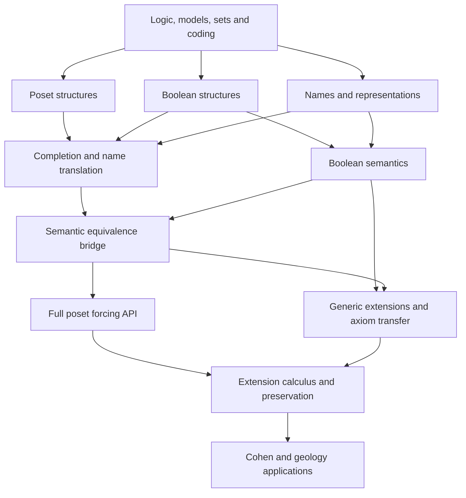

# Long-term forcing architecture: two interfaces and verified bridges

Design date: 2026-09-08. Status: owner-directed architecture and implementation plan; no forcing code or new theorem is claimed. This is the single authoritative forcing design within `dev/literature`. The implementation surveys and application notes linked below supply evidence and detailed proof obligations; they do not define alternative plans. This plan does not replace `dev/TEACHING.md` or authorize changes to the concurrent teaching work.

## 1. Architecture decision before application milestones

Build a general set-forcing framework with **two fully usable public interfaces, poset and Boolean-valued, connected by systematic verified bridges**. Both interfaces and their correspondence are required parts of the architecture from the beginning. Develop their shared mathematical foundations once, give each theorem an appropriate substantive home, and export other presentations through proved transport. Prefer expressive Cubical Agda types, functions and safe recursion for mathematical constructions; provide explicit internal coding and correctness bridges wherever a theorem requires objects or definitions inside a ground model.

The preferred initial semantic proof home is Boolean-valued names and semantics, matching the existing truth-parameterized evaluator. The poset interface is equally first-class: applications must be able to reason directly about conditions, dense sets, supports, closure and iterations. Its users must not reconstruct Boolean translations at each call. Early probes may change the internal representation or proof home, but cannot remove either interface, weaken bridge obligations, or replace the general framework with a single-application construction.

The purpose is a durable semantic route through Cohen forcing, ground definability, intermediate models, deeper geology, iterations, symmetric extensions and suitable class forcing. Global trophy numbering is fixed: T1 is existing L⊨ZFC; T2 is existing L⊨GCH; T3 constructs an actual ordinary two-valued model N of ZFC + not CH; T4 is ground-model definability. T3 must first deliver the universal forcing results, both public interfaces and the required bridges, then instantiate a reusable ordinary-ultrafilter quotient construction. A supplied-generic theorem alone does not complete T3. Neither trophy licenses a specialized forcing engine or incomplete general API.

The selected T3 instance constructs the Cohen poset and its completion B inside L, develops the Boolean model of L-names and top-value ZFC/not-CH proofs, constructs an ordinary ultrafilter U, and returns the quotient N with satisfaction proofs. The target additional assumption is the existing `LEM (ℓ-suc ℓ)`, with no supplied G, U or model-existence premise; this budget and its witness/universe obligations remain to be checked. N is an ordinary first-order model, not asserted externally well-founded or an actual generic extension of L. The generic-extension API remains independently mandatory.

T1-T3 will also be packaged as a semantic CH-independence headline: actual ordinary models of one shared ZFC theory satisfy respectively CH and not CH. The positive side needs the existing L model/GCH-to-CH adapters. This aggregate is planned, not already proved, and is not syntactic or PRA relative consistency. The [Cohen roadmap](cohen-implementation-roadmap-2026-09.md) defines K0-K15 and the acceptance conditions.

| Trophy | Public result | Status |
|---|---|---|
| T1 | L satisfies ZFC | Proved under the existing LEM hypothesis |
| T2 | L satisfies GCH | Proved under the existing LEM hypothesis |
| T3 | Construct N with ordinary N ⊨ ZFC + not CH | Planned; no supplied generic or ultrafilter at the final instance |
| T1-T3 aggregate | Semantic CH independence: actual ordinary ZFC models on both sides of CH | Planned; requires shared theory/CH adapters and T3 |
| T4 | Ground-model definability | Planned; theorem and scope unchanged |

"Optimal" here means meeting explicit design criteria: cohesive mathematical units, low cross-layer coupling, reusable hypotheses, transparent assumption costs, complete public theorem contracts, and minimal mechanical proof duplication. There is no measured global optimum or reliable implementation-time percentage. A choice is justified by its consumers and proof obligations, then tested with meaningful prototypes.

The source scope of this design task is only the literature notes. Preserve `L⊨ZFC` and `L⊨GCH`, their statements and their single `LEM (ℓ-suc ℓ)` hypothesis. No new forcing, choice or class-recursion assumption may leak into these existing results.

## 2. Long-term scope and model of reuse

The framework has a permanent architecture and an incremental delivery schedule. A component can be scheduled later while its extension points and required relationships are designed now. Later work must extend the same framework rather than create parallel universes with incompatible syntax, names or model notions.

| Long-term capability | Required interface or theorem family | Completion boundary |
|---|---|---|
| General set forcing | Both public interfaces, names, definability, generic truth, axiom transfer | Required foundation |
| Forcing equivalence | Completion, generic/name/formula transport, compositional coherence | Required foundation and structure bridges |
| Products and two-step iterations | Poset constructions, complete embeddings, projections, Boolean quotients | Required extension calculus |
| Long iterations | Explicit support policies, limits, factorization and preservation assumptions | Required future family, delivered by named support regimes |
| Intermediate models and advanced geology | Complete subalgebras, quotient extensions, covering characterizations, model comparison | Required future clients |
| Symmetric extensions and choiceless geology | Automorphisms, subgroup filters, hereditary symmetry, restricted-name truth | Required extension boundary; additional theorems scheduled separately |
| Class forcing | Classes, class parameters, recursion and forcing-theorem capabilities | Separate required research/development track, with explicit hypotheses |
| Ordinary model realization | Fullness, ordinary ultrafilter construction, set quotient and formula truth | Required generic component and actual T3 instance |
| Proof systems, syntactic independence and PRA relative consistency | Not required by this semantic program | Outside the committed roadmap; reconsider only for an explicitly selected future theorem |

"Complete public interfaces" does not mean formalizing every known forcing or preservation theorem before any application. It means that the declared general set-forcing API is mathematically complete in both presentations, including actual generic extensions, and that later layers have explicit homes and contracts. Long-support, symmetric and class-forcing capabilities each receive their own honest completion status.

A Boolean-valued countermodel and an actual generic extension are distinct endpoints. A conditional extension theorem takes its generic as input. Countability-based generic existence is a separate constructor. Neither completeness of first-order logic nor an arbitrary ultrafilter supplies a prescribed transitive ground's generic extension automatically.

## 3. Shared foundations and independent design axes

Three axes must remain independent: the poset/Boolean presentation, the host/internal representation, and the set/class size regime. No record should identify one choice on an axis with a choice on another.

### 3.1 One object language and honest model profiles

Reuse `FOL.Syntax`, its formula transformations and `FOL.Semantics`. Introduce one first-order ZF/ZFC theory with actual axiom sentences and formula-generated separation/replacement or collection schemas. Define CH and GCH in the same language with semantic correctness bridges. Forcing adds formula transformations and parameter slots, not a second incompatible syntax library.

Keep the existing strong hProp-valued model interface for concrete constructions and add the general first-order profile. Existing host `WellFounded` membership and host-indexed exact numerals are stronger than internal Foundation and Infinity and must remain visibly separate. Adapters to first-order satisfaction must prove equality coherence between the structure's `≈ˢ` and the relevant ordinary equality, along with the axiom bridges; they are not record coercions justified by matching names.

Ordinary first-order models, externally transitive models and Boolean-valued structures have different contracts. Do not require host accessibility from arbitrary first-order models. Boolean equality is a truth value and is not silently path equality. Concrete transitive realizations can use path equality once their correctness is proved.

`Base.Truth.TruthAlgebra` remains an operation signature. Add law-bearing algebra and equality/congruence interfaces alongside it. A Boolean-valued axiom package must not instantiate the hProp-specific `isZFModel` by an unsafe reinterpretation.

The formula compiler is a host-level syntactic transformation with a correctness theorem for each input formula. Its output defines that formula's forcing/value relation inside the ground. It must not assert one internal global truth-value predicate for all formulas of the ground's own universe. Uniform syntactic compilation and external satisfaction for a set-sized model do not imply internal self-truth. Bell's p. 24 makes this distinction explicit; see the [Bell reassessment](bell-2005-route-reassessment-2026-09.md).

Bell's Collection-form Replacement and induction-form Regularity require proved equivalences to the selected first-order schemas. Distinguish internal induction from external accessibility. Record the source ground theory as well as the extension's axiom conclusion: ZF transfer from a ZFC ground is not automatically a ZF-ground theorem.

### 3.2 Host constructions with model-internal correctness

Use host functions and safe recursion where they express the mathematics naturally. For internal use, relate host presentations to ground set codes by proved representation relations. Export recognition, existence, uniqueness or invariance as appropriate, rank bounds, closure of codes in the model, and agreement of evaluation. A code/presentation round trip generally preserves denotation; it need not recover identical raw syntax.

This follows the useful pattern already exercised by L: an external construction and an internal description connected by a correctness theorem. It does not assume every host family belongs to a ground, or that every host name has a code in every model. One useful common name presentation may be a well-founded family labelled by conditions or Boolean weights; adopt shared recursion only where the laws and universe requirements really coincide. Do not force all name theories through an overgeneral record merely to avoid a small definition.

In a univalent host, a universe-indexed raw-name presentation is not automatically an h-set. F0 must check the `isSetS` requirement of `ZFStructure`, or justify a suitable set-level presentation and descent of semantics. An ordinary extensional-set quotient cannot be reused without proving that it preserves the required Boolean-valued equality and membership.

### 3.3 Sizes, choice and families admitted by semantics

Make completeness a law about a stated class of families. Distinguish host-indexed complete Boolean algebras from algebras complete for set-coded families in a ground. `M`-internal completeness does not yield joins over arbitrary external families absent from `M`.

The shared semantic mathematics should state the joins it actually uses. Atomic name semantics uses support families; unbounded formula quantification needs a proved set of truth values or a sufficient rank/collection bound. Prove independence of the bound and internal definability. Only install an evaluator into the existing carrier-wide `TruthAlgebra` when its demanded joins are genuinely supplied. A restricted model-relative evaluator may instead share formula recursion lemmas with it through an explicit agreement theorem.

Ground Collection/Replacement, rather than the still-unproved extension axiom, must fund witness-rank bounds needed to define forcing. Do not use fullness to define a supremum whose existence fullness itself needs. The dependency graph of quantifier values, mixing, fullness, internal definability and axiom transfer must be checked before large proofs begin.

Record host LEM, resizing, host set choice, internal model choice, genericity, transitivity and recursion hypotheses separately. Eliminate truncated existence only into an allowed target; data-valued selection needs uniqueness or actual selection data. Retain theorem variants with minimal hypotheses. The general name/forcing kernel must not assume AC solely because the first concrete extension targets ZFC.

## 4. Cohesive components and allowed dependencies

The following are responsibility names, not final Agda module paths. Source placement and chapter boundaries must be coordinated with the current teaching architecture when implementation begins. Each row may require several coherent chapters; it is not a demand for a giant module or a micro-module per field.

| Component | Owns and exports | Depends on | Must not depend on |
|---|---|---|---|
| Logic and model foundations | Syntax, axiom schemas, satisfaction, equality laws, model profiles and semantic correctness | Existing generic foundations | A forcing presentation or an application |
| Set mathematics and representation | Internal functions, ordinals, cardinals, rank, set satisfaction, coding adapters | Logic and models | L-specific condensation, Cohen or geology |
| Poset structures | Preorders, compatibility, dense sets, filters, maps, closure/support vocabulary | Generic sets/order mathematics | Boolean axiom transfer or geology |
| Boolean structures | Algebra laws, admitted joins, subalgebras, filters, ordinary ultrafilter existence under named assumptions, algebraic maps | Generic sets/order mathematics | Cohen or a full poset forcing theorem |
| Name representations | Raw names, support/subname recursion, check/generic names, code relations | Sets/models and appropriate labels | Fullness, extension ZFC or applications |
| Boolean semantics | Atomic values, congruence, formula values, mixing/fullness under explicit hypotheses | Boolean structures, names, logic | A poset truth theorem used in its own proof |
| Ordinary model realization | Quotient carrier, descended relations and formula truth for full Boolean models | Logic/models, Boolean structures, explicit ultrafilter and fullness capabilities | Cohen, geology or a genericity hypothesis |
| Completion and representation bridge | Separative quotient, regular opens, maps, name translations, coherence | Poset/Boolean structures and names; semantics for formula bridge | Application-specific preservation |
| Poset forcing API | Forcing clauses, monotonicity, density, formula compiler, public theorem wrappers | Shared names and proved semantic/completion bridges | Cohen-specific names or assumptions |
| Generic extensions and axiom transfer | Valuation, extension, embedding, truth, ordinal and ZF/AC transfer | Models, names, semantics and relevant bridges | Ground definability or CH |
| Extension calculus | Products, iteration/factorization, quotients, complete-subalgebra transport | General interfaces and extensions | A theorem about the mantle |
| Preservation | Possible-value bounds, cardinal/cofinality and closure-dependent results | Core and the required structural capabilities | A particular application for a general theorem |
| Applications | Cohen, geology, later symmetric/iteration/class clients | Their declared capabilities | Other applications merely for generic helpers |

Within a row, separate structural constructions from semantic transfer if that removes a cycle. In particular, completion construction precedes the theorem comparing forcing relations; iteration data precedes the semantic iteration theorem. Do not let the same module both construct a foundational object and import a downstream theorem that presupposes it.

A simplified dependency view shows the central joins. Additional contracts remain in the table.

## 5. Two full public interfaces with canonical proof ownership

### 5.1 Poset interface

Accept nonempty preorders with q ≤ p meaning q is stronger. Treat a top element, antisymmetry, separativity, atomlessness and closure properties as additional data or proved adapters. Preserve trivial forcing. The public theory must provide:

- conditions, compatibility, dense/predense sets, generic filters over a specified model;
- names, check and generic names, valuation and model-relative name coding;
- internal forcing formulas, the standard recursive clauses, monotonicity, density/stability, equality/substitution and the truth lemma;
- actual extension and ZF/AC/ordinal transfer with complete hypotheses;
- usable morphism, product, iteration, quotient and preservation interfaces as their layers are delivered.

Forcing can initially be defined through Boolean values after completion. Nevertheless, prove that it satisfies the ordinary poset recursion and an appropriate uniqueness/characterization theorem. This is a substantive correspondence, not a second name for a definition. A poset user should apply these clauses directly without opening the completion's implementation.

Preserve the condition representation for combinatorial proofs. Closure and support are often properties of the presentation, not automatic invariants of Boolean completion. Never discard them just because the forcing semantics is equivalent.

### 5.2 Boolean interface

Provide algebraic forcing over arbitrary appropriate nontrivial complete Boolean algebras, rather than only one Cohen regular-open algebra. Export weighted names, Boolean membership/equality, formula values, check names, and law-based reasoning. Explicit-family mixing, a unique-existence witness theorem, and general fullness/maximum principle are separate theorem packages with their required assumptions. Boolean uniqueness does not give unique raw names. Bell Problems 1.29-1.30 distinguish the no-AC unique-witness result from the maximum principle uniformly over all complete Boolean algebras, which is equivalent to AC.

Provide model-relative generics, generic specialization and actual-extension correspondence, together with Boolean logical laws and semantic axiom validation. Proof-system soundness is not required. An arbitrary-ultrafilter quotient is a required, separately specified ordinary-model endpoint for T3; it is not presumed externally well-founded or identified with a generic extension.

The nonzero part B⁺ supplies a poset adapter. Direct algebraic applications must also be able to use B itself, including complete subalgebras, without constructing a redundant new regular-open universe at every step.

### 5.3 Where to prove each theorem

| Theorem family | Preferred substantive home | Other interface receives |
|---|---|---|
| Boolean atomic equality and logical laws | Boolean semantics | Poset laws via completion/name translation |
| Concrete condition compatibility, supports and closure | Poset structures | Exactly the transfer theorem justified for the property |
| Name evaluation and representation invariance | Shared representation/valuation mathematics | Specializations for poset and weighted names |
| Generic truth | One core proof per genuinely distinct model profile | Other presentation via generic/value correspondence |
| ZF transfer and AC preservation | Shared semantic axiom-transfer layer, initially Boolean proof home | Poset theorem through a proved extension/model transport |
| Cardinal/cofinality preservation | General preservation layer using stated chain/decision hypotheses | Equivalent formulations through supported bridges |
| Intermediate models | Complete-subalgebra and extension calculus | Poset formulation via quotient/factorization bridges |
| Internal definability | Formula/code compiler with semantic correctness | Both public forcing predicates |

Canonical proof ownership is not a ban on all second proofs. A different assumption profile, class-size regime or stronger computational specification may require a genuinely different argument. Document that mathematical difference. Avoid mechanically reproving the same axiom or theorem merely because its public notation differs. Prefer local abstraction over a few shared laws to an all-encompassing forcing record.

## 6. The equivalence bridge is a required subsystem

For set forcing, bridge results are required deliverables, not optional future suggestions. Each bridge records model, level, assumptions, transport on data, preservation laws and its round-trip meaning.

| Bridge | Required assertion | Acceptance witness |
|---|---|---|
| Completion | Separative quotient and dense map into RO(P), computed in the intended model | A nonseparative example and the B⁺ adapter |
| Generic filters | Corresponding model-relative generics in both directions | Same dense sets met after the stated transport |
| Names | Translation, valid ground codes, support/rank bounds, and denotational round trips | Check names, generic names and an existential witness family |
| Atomic and formula semantics | p forces φ iff i(p) is below the value of translated φ; standard poset clauses | Membership, equality, negation and an unbounded quantifier |
| Extensions | Corresponding valuations give isomorphic extensions, fixing the embedded ground | Membership/equality and satisfaction transport, not just carrier bijection |
| Morphisms | Identity/composition laws and completion lifts for the specified map classes | Dense embeddings, complete embeddings and projections distinguished |
| Iteration and quotient | Generic factorization and extension agreement under the supported comparison | One nontrivial two-step iteration and quotient |
| Properties | Explicit invariant/one-way/presentation-dependent classification | Chain-condition theorem, size bounds and a closure non-transfer boundary |

Completion uniqueness must compare any two certified completions of the same forcing presentation, permitting a specialized backend alongside the canonical RO construction. Complete-subalgebra inclusions receive atomic and bounded-formula transport by default, not arbitrary-formula elementarity; this differs from full semantic transport along a Boolean isomorphism or a dense forcing equivalence.

The maps form coherent translations: translate twice or compose the corresponding maps and obtain the same semantic result. Raw-name equality is not required. Not every monotone map extends to the desired complete Boolean homomorphism; the admissible map hypotheses must be part of the theorem.

Prove bounds rather than silently identifying sizes. Completing P can substantially enlarge its cardinality; small-forcing geology estimates must remain available in terms of the original P when that is the intended theorem. Internal choice used to refine weights by conditions or antichains must not become an unmentioned global host choice principle.

### 6.1 Choiceless completion and property transport

Separate completion existence, forcing-semantic equivalence, and preservation of presentation properties. Karagila-Schweber explicitly note in section 5.3 that the quotient and Boolean-completion constructions need no Choice. Conversely, a nontrivial set-sized complete Boolean algebra supplies the forcing preorder B⁺ directly. This does not identify arbitrary Boolean-valued structures with universes of forcing names, nor does it assert that all extra properties survive completion. [Choiceless chain conditions](https://link.springer.com/article/10.1007/s40879-022-00564-2#Sec5).

In the choiceless API, keep three predicates separate: every maximal antichain is countable (CCC₁), every antichain is countable (CCC₂), and every predense set has a countable predense subset (CCC₃). Their ZFC equivalence must be an explicit theorem, not definitional equality. Corollary 6.5 shows the failure of a general CCC₂-preserving completion theorem in the choiceless setting. Section 7 extends the discussion to higher chain conditions; DC assumptions there must not be reinterpreted as prerequisites for completion itself. Preserve the original poset and record the exact direction and hypotheses of every chain-condition transfer. This refines the property bridge in the table above.

Provide an automatic, proof-producing completion adapter: a model-coded forcing presentation is mapped to its model-internal regular-open algebra, its dense map and the structural correctness certificates. Name, formula and generic translations attach their own semantic certificates. Reverse name translation should investigate using all refining conditions, rather than choosing a representative below each nonzero Boolean value and silently introducing Choice. The mathematical completion is a symbolic construction over sets and predicates, not a promise of an executable procedure enumerating an arbitrary infinite powerset. Tactic or elaborator automation can later invoke these proved constructions; it must not automatically transfer chain conditions, closure, size or maximum-principle capabilities without the corresponding theorem.

## 7. Farther extensions are designed now

### 7.1 Iterations and intermediate models

Expose restriction maps, embeddings, projections, factorization and support policies independently of a particular Cohen example. Implement two-step iterations and quotients first. Extend to named limit/support constructions with their own closure and preservation hypotheses, rather than a single supposedly universal iteration theorem. Boolean and poset presentations of an iteration must agree at the generic-extension level, without forcing their raw limits to be definitionally identical.

Complete subalgebras and the intermediate model theorem are long-term requirements. They are natural join points for the two interfaces. The ground-family relativization results should consume these interfaces, not inspect how a specific iteration was built.

### 7.2 Symmetry and choiceless models

Reserve actions on conditions and names, equivariance of forcing and translation, subgroup filters and hereditary symmetry as additional structures. Do not require symmetry data of ordinary forcing. A symmetric extension restricts the names admitted; its truth and axiom theorems need separate proofs under the appropriate ZF profile. General full-extension AC preservation does not apply automatically to it.

This boundary has an actual geology consumer: Usuba's work on symmetric grounds studies ZF models and additional hypotheses for definability and directedness. [Primary paper](https://arxiv.org/abs/1912.10246).

### 7.3 Class forcing and class recursion

Treat the set/class distinction as a mathematical theory boundary, not merely a larger Agda universe parameter. Plan class predicates and parameters, admissible class comprehension/recursion, and a capability saying which forcing relations exist. Individual set-names remain sets even when the collection of conditions is a proper class; class-names need a separate contract.

Class forcing does not inherit the unconditional set-forcing completion and truth package. The forcing theorem and suitable Boolean completions can fail; completion uniqueness also needs care. State results under verified hypotheses, such as appropriate tameness/recursion conditions, as each targeted class construction requires. Do not globally assume a class forcing theorem because a host function can be written. [Holy et al.](https://arxiv.org/abs/1710.10820), [Gitman et al. on exact strength](https://arxiv.org/abs/1707.03700).

Class iterations are already used in deeper geology, for example the Reitz-Williams inner-mantle and iterated-HOD constructions. This motivates the boundary without pretending that it has been implemented. [Primary paper](https://arxiv.org/abs/1810.08702).

### 7.4 Deeper geology and the semantic scope boundary

Generalize model-comparison, approximation, cover and uniform-cover interfaces independently of the forcing that supplies them. Bukovský-type characterization and Usuba's directedness arguments need more than adding particular posets to a catalogue. They also expose the importance of exact weak-theory choices: Collection and well-ordering assumptions cannot be silently interchanged with weaker formulations once Power Set is absent. [Usuba, Facts 3.9 and Note 4.1](https://arxiv.org/html/1707.05132v2).

The committed program requires formulas, substitution, satisfaction, axiom schemas, relativization, forcing definability and generic truth. It does not require deduction rules, a derivability relation, proof-system soundness/completeness, syntactic consistency, or a deep embedding of PRA. Induction on formulas and semantic correctness are not induction on formal derivations. First-order completeness, if added in a future branch, converts semantic consequence over all ordinary first-order models into derivability; it does not convert truth in selected transitive models, L or particular extensions into ZFC derivability. It also presupposes a specified deduction system. Such a proof-theoretic branch remains possible, but is neither a postponed mandatory milestone nor a prerequisite for calling the Cohen extension and geology results complete. A future theorem that actually needs it receives a separate scope decision. No mantle, large-cardinal or class-recursion hypothesis belongs in the basic set-forcing records.

## 8. Delivery order: contracts before trophies

The architecture in sections 1-7 is fixed as the direction. The phases below retire representation risks, then deliver coherent parts of that architecture. Neither a successful Cohen example nor an external ground-definability predicate can replace a required phase.

| Phase | Prerequisites | Deliverable and exit criterion |
|---|---|---|
| F0: contracts and proof-bearing prototypes | Current audits and this design | Freeze model/size/assumption interfaces; compile safe atomic-name, carrier-h-level, quantified-join and internal-code probes; assign canonical proof homes; identify closure and size non-invariants |
| F1: reusable foundations | F0 | First-order theory/model adapters with equality coherence; internal functions/cardinals/rank/coding prerequisites; lawful poset/Boolean structures; no application imports |
| F2: names and structural bridges | Relevant F1 | Host presentations and ground codes, check/generic names, valuation, RO completion and B⁺, name translation with bounds and structural map laws; semantic round trips belong to F3/F4 |
| F3: Boolean semantics and internalization | F1, F2 | Atomic laws and formula values at valid sizes; ground-code closure and evaluator agreement on the stated admitted families and universes; canonical Boolean formula compilation; mixing/fullness under named assumptions; no circular use of extension ZFC |
| F4: poset semantics and generic correspondence | F2, F3 | Standard forcing clauses and characterization; transported poset formula compiler and its correctness; generic transport and truth correspondence; extension isomorphism fixing the ground |
| F5: full general set-forcing APIs | F3, F4 | ZF and separate AC transfer, ordinals, complete public theorem interfaces in both presentations, source/semantic axiom bridges and trivial-forcing identity; early general chain-condition/possible-value preservation slice needed by C2/G1 |
| F6: first application completion | F5 for headline results; work-package prerequisites below | Complete Cohen C1-C5 for T3, then geology G1-G4 for T4; independent preparatory lemmas can start earlier |
| F7: extension calculus and mature bridges | F2-F5 | Products, nontrivial two-step iteration, quotients, intermediate models and compositional/property bridges; shared preservation interfaces |
| F8: named advanced families | F7 and family-specific theory | Long-support iterations, symmetry, class forcing and deeper geology under explicit additional hypotheses |

F1 is a sequence of motivated units, not a requirement to finish every future cardinal theorem before names. F2 and F3 can overlap on disjoint structural and semantic work. The abstract uniqueness part of G2 can proceed alongside forcing once its foundations are ready. The first application can be proved before all of F7/F8, but only after F2-F5 have exercised both interfaces and the core semantic bridge. F7/F8 remain required long-term work with stated scope, not features cancelled when an initial theorem passes.

Within F3, first establish set-coded or bounded quantifier-value existence and independence of bounds, then formula values and compiler correctness; mixing and fullness/maximum-principle packages follow under their own assumptions. The general F4 generic-truth contract must not require fullness or the maximum principle. The separately scoped ordinary-ultrafilter quotient theorem is now required for T3 and uses fullness, as in Bell Theorem 4.1; it does not replace genericity or the actual-extension correspondence. F5 schema-transfer bounds use ground Collection/Replacement and F3/F4 definability, never extension ZFC as a premise. Agreement with the host evaluator is conditional on both evaluators admitting the relevant families; no theorem identifies ground completeness with unrestricted external completeness.

T3 is the actual ordinary Cohen model, followed by T4 ground definability. Their independent infrastructure can still progress alongside one another. F0 is now in progress, concretized as K0 in the [Cohen implementation roadmap](cohen-implementation-roadmap-2026-09.md); it is not a specialized proof of either headline theorem. K0-K15 refine delivery through trophy 3 without replacing the F0-F8 architecture.

### 8.1 Cohen work packages

C1 constructs Add(ω,κ) from finite partial functions inside a ground, proves compatibility and coordinate-density, and obtains ccc through a reusable finite-support argument. C2 applies general chain-condition preservation to the required ground cardinals and forms an internal indexed family of pairwise distinct generic reals. C3 derives extension ¬CH, hence ¬GCH, for κ = ω₂ of the ground. No ground GCH, exact continuum upper bound or nice-name enumeration is required for this theorem.

C1 can start after the relevant F1 finite-set and poset foundations. C2 requires C1, generic evaluation and the early general preservation slice delivered by F5; C3 additionally requires the complete extension/model and semantic bridges. This preservation slice lives in the general preservation component, not in the Cohen application; F7 extends it for iteration and quotient clients.

Expose both the poset statement and its Boolean counterpart through the common bridge. Keep generic existence separate from the conditional extension theorem. Existing L provides the positive GCH branch after the appropriate adapters; do not add collapse forcing merely to duplicate it. Object-language CH/GCH correctness is retained for semantic statements; proof-system soundness and syntactic independence are outside this roadmap; the actual-model semantic independence package is required. [Detailed Cohen obligations](cohen-infrastructure-overlap-2026-09.md).

C4 adds generic fullness and ordinary-ultrafilter quotient truth, constructs the ultrafilter in the L instance, and produces the actual ordinary model of ZFC + not CH. C5 combines that model with the existing L results under shared first-order ZFC/CH interpretations to expose semantic CH independence. These refine K12-K15. Do not infer top-value Boolean validity from a potentially vacuous supplied-generic implication. The actual quotient is not required to satisfy the strong external-well-foundedness fields of the current model record.

Ordinary ultrafilter existence and fullness must be established from the stated ground assumptions. In the L instance, internal Choice is available, but transferring witnesses to host data is an explicit construction obligation. Genericity is not required for this quotient theorem. Conversely, this theorem does not replace the general generic valuation and extension correspondence. F3 owns the shared Boolean semantics, F5 owns generic model realization and quotient truth, and the Cohen application owns only specialization and its headline theorem.

### 8.2 Ground-definability work packages

G1 proves small-forcing cardinal estimates, approximation and cover with explicit ground sizes. G2 proves model uniqueness from approximation/cover and the chosen small parameter without a forcing hypothesis. G3 proves rank-local fragment satisfaction, localization and the actual constant-free defining formula. G4 joins these into ground definability and then a total family of grounds, including the first-order valid-ground test and parameter-membership guard. Later up/down relativization consumes F7.

G1 requires F4/F5 and the early preservation slice. Abstract G2 requires the relevant F1 model/cardinal foundations, independently of forcing. G3 requires G2 and rank/set-satisfaction/coding infrastructure, also independently of a forcing implementation. The headline G4 result requires G1, G3 and the completed F5 contracts.

Forcing supplies G1 through either public interface, with the original poset size retained. Ccc alone does not supply the approximation parameter wanted by geology. G2/G3 depend on generic set-model mathematics, not Cohen, L's condensation or Boolean completion implementation details. [Exact statements and source ledger](ground-definability-proof-2026-09.md).

## 9. Design and implementation acceptance

Every dispatched source brief must name its component, public contracts, assumptions, canonical proof home, actual consumers, required bridges and permitted files. It must explain how its result advances a phase in section 8. Required architecture work cannot be removed by silently narrowing a theorem to L, to Cohen, to a countable ground or to host-complete Boolean algebras only.

Acceptance is evidence-based:

- Both interfaces expose usable mathematics; poset wrappers include the standard clauses and verified internal definability, and Boolean APIs include actual generic-extension use and verified logical/axiom semantics.
- The foundational bridge is exercised before either headline application: a nonseparative presentation, check and generic names, atomic equality/membership, a genuine existential case, trivial forcing, and a model-relative instance with correctly scoped completeness.
- F7 adds at least one nontrivial two-step factorization/quotient and checks composition of name/generic translations. No claim that full structural equivalence is complete before those tests.
- Shared statements have one substantive home and all real consumers use it. No application namespace owns an unrelated generic helper, no compatibility shell hides duplicate foundations, and no giant record forces irrelevant assumptions on clients.
- Equality of names, semantic equality, extension isomorphism and equality of internal codes are distinguished. No proof depends on a convenient but unproved definitional coincidence.
- Cycles among definability, quantifier bounds, maximum principle and axiom transfer are ruled out by the actual dependency graph. Extra type-level operations do not masquerade as internal set existence.
- No requirement that every closure/support property survive completion. Each advertised transport has exact hypotheses and direction, including size changes and possible weaker conclusions.
- Every proof remains `--safe`, with no holes or unsound pragmas. Scoped Agda checks use the repository memory guard; integration includes `make check` and all required chapter, route and site updates under the future implementation brief.

Measure source size, check time and memory as costs, not objectives. Avoid duplicate proof scripts, but allow distinct useful representations, explicit transport and modest theorem duplication when assumptions or specifications differ mathematically. Host-level opacity may protect performance; public semantic specifications must remain sufficient for clients.

F0 must end with a concrete reviewable selection of representations and an assumption ledger, not empty records for all future work. If a prototype fails, record the exact type/size/termination obstruction and revise the implementation strategy within the two-interface architecture. No unverified prototype is reported as a theorem.

## 10. Evidence notes and document authority

[K0 probe evidence](k0-probe-evidence-2026-09.md) records checked finite cases, the raw-name h-level obstruction, and the still-open model-internal coding and quantifier obligations. It does not mark F0 complete.

The [Cohen implementation roadmap](cohen-implementation-roadmap-2026-09.md) refines the first application into K0-K15 with package prerequisites, automatic-conversion contracts and acceptance conditions. It is subordinate to the component boundaries in this master plan.

The [Bell 2005 reassessment](bell-2005-route-reassessment-2026-09.md) refines the compiler, witness, schema and morphism contracts using the [searchable textbook](bell-2005-boolean-valued-models.fulltext.md) and [retained PDF](bell-2005-boolean-valued-models.pdf).

Use these notes for their stated roles:

- [Forcing implementations and classical textbook routes](forcing-formalizations-2026-09.md): literature evidence, not a competing scheduling recommendation.
- [Flypitch4 source audit](flypitch4-source-audit-2026-09.md): pinned Lean 4 evidence, inspected rather than rebuilt.
- [Bedrock interface audit](forcing-bedrock-interface-audit-2026-09.md): current reuse and model/universe limitations; source locations may move during teaching work.
- [Cohen, L and Flypitch4 comparison](cohen-flypitch4-design-2026-09.md): application tradeoffs under this architecture.
- [Cohen infrastructure overlap](cohen-infrastructure-overlap-2026-09.md) and [ground-definability proof](ground-definability-proof-2026-09.md): branch-specific obligations.

The older [geology dossier](geology.md) is historical research, with its own evidence limits. Use the exact sources and corrected statements in the newer proof note. When a literature source or older note suggests an implementation route, this owner-directed architecture determines the current project choice. It replaces the previous poset-first and optional-Boolean-bridge recommendations without retaining them as active alternatives.

## 11. Detailed obligations for the first geology application

Use the exact source statements and comparison lemmas in the [proof note](ground-definability-proof-2026-09.md). The short source anchor is Fuchs-Hamkins-Reitz, Theorems 5-6, Definition 7, Lemmas 8-9, Fact 10 and Theorem 12. They distinguish ground definability, the more general approximation/cover situation, and the stronger indexed ground family. [Primary text](https://arxiv.org/html/1107.4776v2).

For implementation, keep the following separate obligations visible:

- Cover and approximation have different size conventions. A statement about a small set in U cannot silently use its W-cardinality. Small tests for approximation come from W.
- Compare genuine rank segments of models, not constructible stages Lα. Existing L reflection does not automatically provide the required rank-local theory for arbitrary W and U.
- The restricted theory ZFCδ still has schema content. A finite Agda record with a field ranging over formulas is not itself a finite first-order axiom. For a set-sized candidate, use internally coded syntax and set satisfaction to express satisfaction of the theory.
- Every local candidate must have the intended transitivity, ordinal height, pair properties and successor-cardinal agreement. A bare subset of a rank segment with some closure fields is not enough. Candidate uniqueness must compare against the actual ground rank segment. Require the explicit three-way equality (δ⁺)^M = (δ⁺)^(Uθ) = (δ⁺)^U.
- Show that sufficiently large eligible heights exist for every x, and prove localization of each pair property. Neither an unexplained appeal to reflection nor an inaccessible cardinal assumption is acceptable.
- Use a single ordered-pair parameter containing the auxiliary cardinal and chosen small data initially. Prove it belongs to W. Compress the parameter to the customary binary-sequence/power-set parameter only after the recovery theorem has been formalized.
- Ground membership must be expressed by `Formula Empty 2` (with the repository's appropriate empty type and slot convention), not by `Formula W 2` with an unbounded ground encoded as constants. A semantic predicate alone is not the deliverable.
- In the indexed-family phase, explicitly require that a valid parameter belongs to its candidate ground. The fallback to U then proves parameter membership for malformed parameters as well.

The first-order inner-class recognition step is a separate mathematical theorem. A truth predicate for an arbitrary proper class is not available. Use a finite characterization via transitivity, ordinal containment, Gödel-operation closure, almost universality and choice, with a proof of equivalence to the intended schemas. Alternatively, a rank-local characterization requires its own proof. The source's reference to Jech 13.9 is a dependency to implement, not a one-line invocation of existing satisfaction code.

The final fixed formula is constructed in stages: local set satisfaction; fragment recognition; rank/cardinal predicates; pair properties; candidate predicate; existential choice of height/candidate; then the ground-validity wrapper required for the total ground family in G4. The basic membership-definability theorem is a separate preceding endpoint. At every stage maintain a semantic equivalence theorem and free-variable bound. This prevents a very long final formula from becoming an opaque, unauditable hand translation.

### 11.1 Proof decompositions

The following are proposed proof decompositions, with their choice and rank obligations exposed. They are not reports of checked Agda proofs. The comparison with the exact literature statements is maintained in the companion proof note.

### 11.2 Small forcing without strategic-closure machinery

For G1, first prove the size-bound case directly. Let κ be an infinite cardinal of W with |P|^W ≤ κ, and let δ = (κ⁺)^W. This avoids finite-cardinal corner cases and makes κ × κ have size κ internally. The more general closure-point theorem is a future extension.

For cardinal preservation, P has no antichain of size δ in W. A name for a function has at most κ possible values at each coordinate, after restricting to conditions deciding that coordinate. Bound the union of possible values in W and rule out a new short cofinal map or collapsing surjection at the relevant ground cardinals. Prove the precise cofinality-preservation statement rather than assuming every cofinality is preserved. In particular, establish regularity of δ in the extension and equality of the two computations of δ⁺.

For cover, take an extension-small set A of ground objects. Bound its elements in a ground rank segment b first. Use a name for an enumeration of A of length μ < δ and a condition forcing its values into b. For each coordinate, collect the possible ground values decided by extensions of that condition. The union of these sets is in W, covers A, and has size at most |μ|^W · κ < δ in W. Record the truth-lemma step choosing the condition and the preservation step identifying the relevant bound on μ.

For approximation, our derived proof decomposition, not a located quotation from a primary source, uses a small **separating test set**. Given a name for A ⊆ b and a condition forcing this inclusion, work below that condition. For each pair of conditions which force contradictory answers about some member of b, choose one such member. The chosen members form a set a ∈ W of size at most κ. Selection is over a set in W and uses W-choice, not host choice. If all small approximations of A are in W, then c = A ∩ a belongs to W. The truth lemma gives p in the generic forcing that the restriction of the name to a is c. If two extensions of p decided some b-member differently, the separating test set would give a contradictory decision about an element of a. Thus p decides every membership question on b. Internal separation using the forcing formula reconstructs A in W.

This argument yields concrete sublemmas: bounded ground support for an ambient set of ground elements; sets of possible values; separating-set existence and size; density of decisions; restriction decided at one condition; and reconstruction by separation. It should be checked against the fully internal forcing conventions established by F3 and F4. It avoids making two-step strategic closure an accidental dependency of the basic ground theorem. Hamkins's broader closure-point lemma is the literature comparison, not a substitute for these implementation obligations. [Hamkins, Lemma 13](https://arxiv.org/pdf/math/0307229).

### 11.3 Localizing rank segments

For G3, separate three facts that a paper can compress into one sentence.

First construct unboundedly many eligible heights. Take sufficiently many successive beth fixed points in a continuous increasing sequence of regular length λ > δ; its supremum is a beth fixed point of cofinality λ. Prove the recursion, strictness and cofinality calculation internally. No inaccessible cardinal is being assumed.

Second compare ranks and beth functions across W ⊆ U. For shared sets, transitivity gives rank agreement once the rank recursion is available in both models. At an ambient beth fixed point θ, establish the ground's corresponding fixed-point bound and the required cofinality inequality. Verify closure under power sets as computed in each model; the two power sets need not be equal. The resulting rank segments satisfy the local fragment separately.

Third localize the pair properties using bounded supports. If A lies in Uθ, choose α < θ bounding all its elements. In a cover proof, trim a global W-cover to its intersection with the ground segment at α; prove it still covers A and lies below θ. In an approximation proof, trim each arbitrary W-test set the same way, so the local approximation hypothesis supplies every global test needed for A. After global approximation gives A ∈ W, rank agreement puts it back into Wθ. Keep finite rank margins for ordered pairs, intersections, and coding explicit.

This separates the fragment theorem, the rank-absoluteness theorem and the pair-localization theorem. None can be replaced by the claim that existing L-stage reflection already does the job.

### 11.4 Schema transfer in the extension

For F5, power set and replacement deserve explicit work orders. For the power set of val(τ), bound possible names for subsets by normalizing them to a set-sized supply of subnames from τ paired with conditions. Internal power set in W forms the candidate collection of names; valuation and separation recover exactly the extension subsets. A semantic statement that subsets have names does not by itself give one set collecting them.

For replacement, start with a name for the domain and a formula forced to be functional. Use definability of forcing to describe witness-name existence below each relevant condition, bound witness ranks through internal collection/replacement, and select a bounded family as required. Collect their values into a name for the image. Prove the internal collection principle from the chosen axiom profile if it is not primitive. A class-sized family of witness names or an untruncated host selector would invalidate this step.

For choice preservation, use ground well-orders of the bounded supplies of names, prove the corresponding enumeration/surjection exists in the extension, and derive the extension's choice axiom internally. This requires care because valuation can identify distinct names; it does not transport a raw ground well-order to the values injectively.

## 12. Validation records

### Architecture revision before the detailed Cohen roadmap

This revision authors only this entry point and the six current forcing/Cohen/geology research notes linked in section 10. It implements no source modules, edits no glossary or teaching routes, runs no Agda/Lean build, and changes no existing landmark theorem. Validation on the seven revised notes:

- `.venv/bin/python scripts/gate/lint-prose.py --check <seven note paths>`: exit 0.
- `.venv/bin/python scripts/gate/check-glossary.py --check <seven note paths>`: exit 0.
- A scoped local check of 21 relative link targets, fenced-block balance and absence of em dashes: exit 0.
- Architecture review reconciled per-package prerequisites, early preservation delivery, evaluator agreement and the F3-F5 proof order. This is a design review, not a checked mathematical proof.

The trilingual source chapter-framework gate and whole-tree typecheck were not run for these English research notes. No source-tree gate success is inferred from a literature-only change.

### Detailed Cohen roadmap follow-up

That earlier follow-up added the original K0-K11 roadmap and selected Cohen before ground definability, and updates links in the two Cohen evidence notes. Its scoped document checks are recorded in the roadmap. No source, glossary or teaching files are changed.
