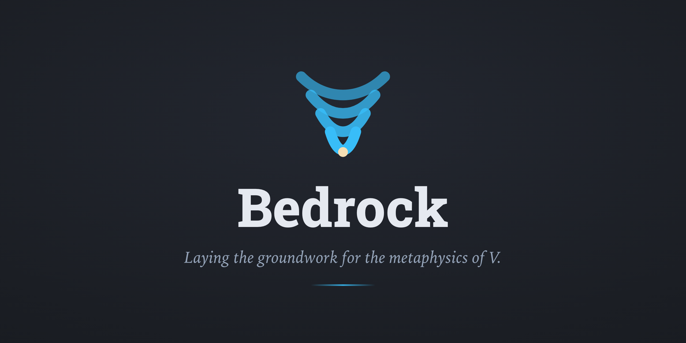

<p align="center"></p>

<h1> Bedrock</h1>

[English](../../README.md) · **中文** · [日本語](../ja/README.md)

[](https://github.com/BedrockInstitute/Bedrock/actions/workflows/ci.yml)

[](https://github.com/agda/agda)
[](https://github.com/agda/cubical)
[](https://creativecommons.org/licenses/by-nc-sa/4.0/)
[](https://www.gnu.org/licenses/agpl-3.0.html)
[](https://api.reuse.software/info/github.com/BedrockInstitute/Bedrock)

*为 V 的形而上学奠基。*

一项在 [Cubical Agda](https://github.com/agda/cubical) 中的机器验证工作，针对当代集合宇宙问题背后的那部分集合论：力迫、内模型，以及 V 的结构。

## 首个目标，已证

第一个自足的目标，是完整机械化：

> **`L` ⊨ GCH**，其中 `L` 是在以高阶归纳类型实现的累积层级 `V` 之上构造的可构造层级。这是一个宿主内部的语义定理。

**它已经证成。**`L⊨GCH` 与 `L⊨ZFC` 都陈述在 [src/Origin.lagda.md](../../src/Origin.lagda.md) 中，各自只依赖 `LEM (ℓ-suc ℓ)`，不多不少：内部基数、内部单射、模型自身的幂集。证明项是 `src/L/GCH/Theorem.lagda.md` 中的 `L⊨GCH`。

内容是哥德尔 1938 年的结果，但证明路线不是教科书上的那条，此前也没有人针对 GCH 走过这条路线。它适合作为第一个目标，因为它会演练本项目其余部分所需的整个基础层：深嵌入的一阶语言、累积层级、`L`，以及双语义机制；同时，它从第一行起就贯彻了下文那套宿主语言最大化的进路。把它做对，其余一切所依赖的基础设施也就得到了校准。

截至 2026-09-22：**25,931 行非空 Agda 代码 · 清空项目缓存后的类型检查 203.17 秒 (保留 Cubical 缓存) · 峰值内存 1.57 GiB。**

截至 2026-09-24，源码依赖图包含 120 个章节、1,511 条不重复的直接导入边和 227 条传递约简边，最长链含 31 个模块；这些计数未应用网站的枢纽与预览过滤。

## 方向

越过这第一块基石，长期目标是把机械化集合论推过它当前的止步处。现有的力迫形式化止步于 Cohen (1963)，而目标是抵达本世纪的成果：力迫作为研究多宇宙的工具、基模型的可定义性、地幔，以及「V 究竟是否具有确定结构」这一更宏大的问题。

这些是目标，不是承诺。每一项都唯有经检验后才会在此宣告。

## 奠基

本项目的目标不是裁定 V 的形而上学，而是为它奠定一份经过验证的根基：将那些为这场争论提供裁决依据的定理 (基模型的可定义性、地幔、脱殊绝对性) 机械化，正是字面意义上的奠基。

一切的出发点是**宿主语言最大化**：不逐字誊抄教科书的 ZF 公理、再围着它们调整证明助手，而是用类型论原生的语汇重构每个概念。因此，宿主语言用于表达数学，深嵌入的 `Formula` 只在其本身成为研究对象时使用。这看上去像奠基的反面，但证明助手提供的是严格性而非还原式的基底，而严格性与元理论的强度无关；宿主语言最大化使机器检验成为可能，其代价也被公开声明。

这份根基也是中立的：集合论地质学为单宇宙观与多宇宙观补上各自缺失的严格立足点，并把争论参数化为所假定的无穷公理的强度，因此本项目不站在任何一边。

完整论述见 [纲领](CHARTER.md)。

## 为何 Cubical

Cubical 类型论是当代类型论的前沿，是当下正被书写的数学基础。而 V 的形而上学是同一探问中最古典的分支，是关于「数学宇宙是什么」的最古老的问题。把最古典的基础问题带入最当代的基础之中，并非一项只能勉强容忍的约束，而恰是本项目的目的之一；这份对照，是有意为之。

这一选择在技术上也站得住脚：累积层级 V 在此以高阶归纳类型实现，cubical 使其可计算，而非仅作公设假定。但更深层的理由，仍是这份张力本身。

## 命名

*Bedrock (基岩)* 是最深的基模型；它是否存在，本身就是一个微妙的、对大基数敏感的问题 (Usuba 定理)。这个词亦取其寻常义：一项探究之下的根基。两重含义皆为本意。

## 作者声明

本项目的所有内容均由 AI 辅助完成，但每一行都经作者逐字审阅，本文档亦不例外。

## 依赖

本项目在下列锁定版本的工具链下进行类型检查：

| 组件 | 版本 |
| --- | --- |
| [Agda](https://github.com/agda/agda) | 2.8.0 |
| [cubical](https://github.com/agda/cubical) | 0.9 |
| [Python](https://www.python.org) | 3.11+ |

`make check` (类型检查、源码与教材检查，以及两套测试) 与站点构建需要 Python 3.11+。开发工具 (`reuse` 检查器) 的版本固定在 [requirements-dev.txt](../../requirements-dev.txt) 中，由 `make venv` 安装到本地虚拟环境。每次推送都会经 [GitHub Actions](../../.github/workflows/ci.yml) 针对上述版本进行类型检查。

首次克隆后，先初始化固定版本的子模块，再安装工具链：

```sh
git submodule update --init --recursive
make bootstrap
make check
```

## 网站框架

可选的 `outcrop-agda` 编译器插桩、构建、类型数据导出与并行调度也由 Outcrop 提供。Bedrock 只保留 [库依赖锁定](../../site/agda-libraries.json)、入口模块、数学检查与本项目的资源及部署配置；见 [工具链说明](../../site/AGDA-ENVIRONMENT.md)。普通 Markdown 渲染不需要安装 Agda。

网站采用 [Outcrop](https://github.com/BedrockInstitute/Outcrop)，由 `outcrop/` 子模块固定版本。**Outcrop Core** 渲染 Markdown 与可选的编译器语义数据；**Outcrop Site** 提供完整交互式教材，包括学习路线、依赖图、多语搜索、类型提示与定义弹窗、外观设置、Ask AI 和可复用检查规则。Bedrock 通过 [site/project.json](../../site/project.json) 提供正文、目录、术语、品牌和数学政策。

初始化子模块后，`make venv` 会安装本地框架包；已有虚拟环境也可运行 `.venv/bin/python -m pip install -e ./outcrop`。随后用 `make site` 构建、`make serve` 预览。详见 [实例说明](../../site/README.md) 与 [Outcrop 架构](../../outcrop/docs/ARCHITECTURE.md)。其他教材可以复用同一框架，无须复制 Bedrock 的数学内容或网站实现。

[site/](../../site/README.md) 保存长期维护的配置、编写规范、术语、阅读元数据与品牌资产。[dev/](../../dev/README.md) 仅保存研究工作材料和临时开发内容，并在相关任务结束后清理。

## 贡献

AI agent 以 [AGENTS.md](../../AGENTS.md) 的唯一规则集为准，人类贡献者请从 [CONTRIBUTING.md](../../CONTRIBUTING.md) 开始。

## 许可

Bedrock 采用多重许可；逐文件的条款在 [`REUSE.toml`](../../REUSE.toml) 中声明，并由 `reuse lint` 验证。简而言之：

- **[CC BY-NC-SA 4.0](https://creativecommons.org/licenses/by-nc-sa/4.0/)**：数学、文稿、编写规范与元数据、品牌资产，具体范围见 `REUSE.toml`。
- **[AGPL-3.0-only](https://www.gnu.org/licenses/agpl-3.0.html)**：第一方软件及适用此许可的配置。Outcrop 单独维护其第三方署名。
- **[OFL-1.1](https://openfontlicense.org)**：Outcrop 提供的自托管网页字体 (`outcrop/src/outcrop/site/resources/static/fonts/`)。

完整许可文本见 [`LICENSES/`](../../LICENSES/)；第三方署名与 AGPL 第 13 条对应源代码声明见 [NOTICE](../../NOTICE)。

Outcrop 独立维护逐文件许可及继承的第三方资源和字体署名。

© 2026 Bedrock Institute。
